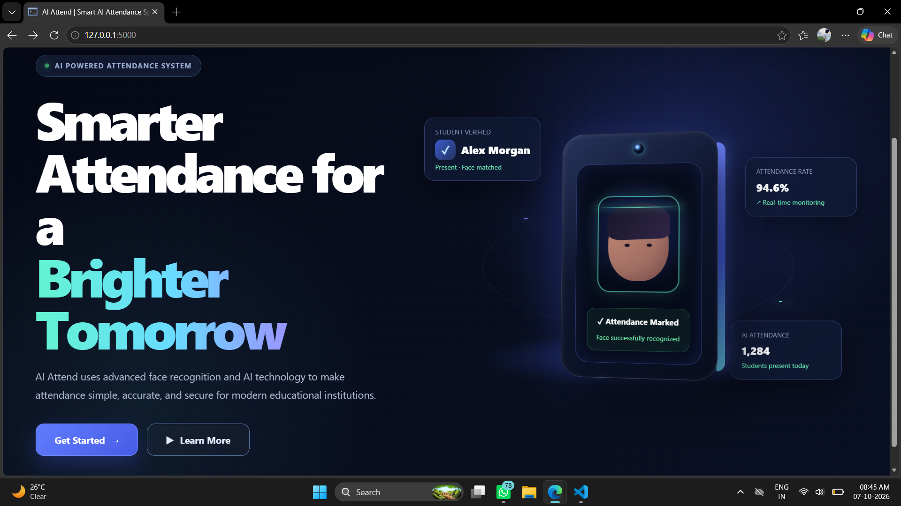
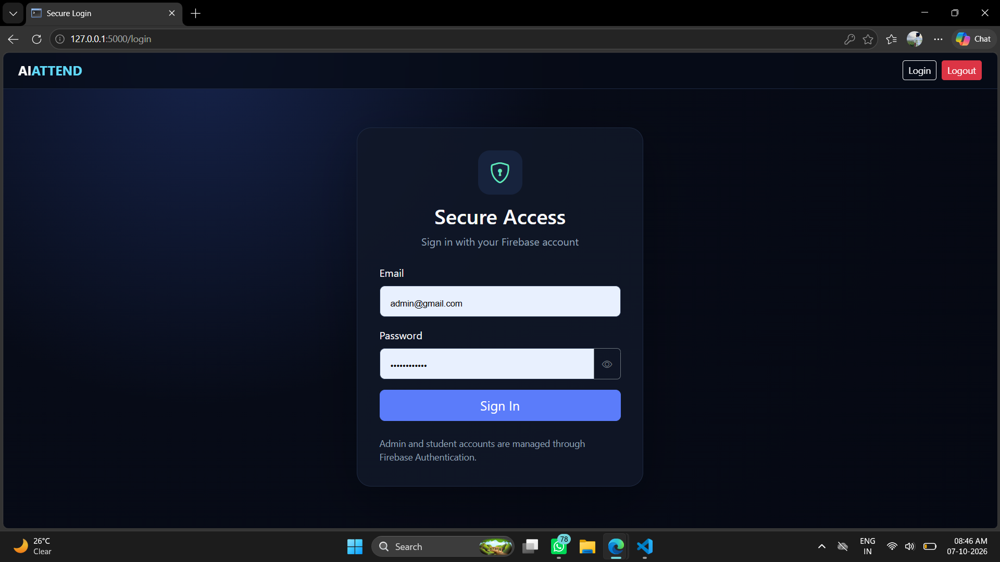
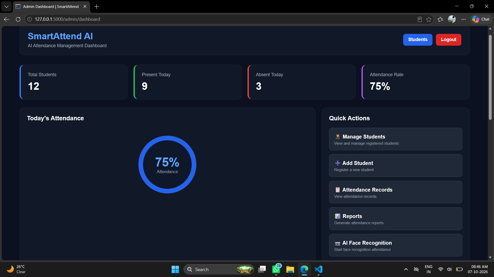
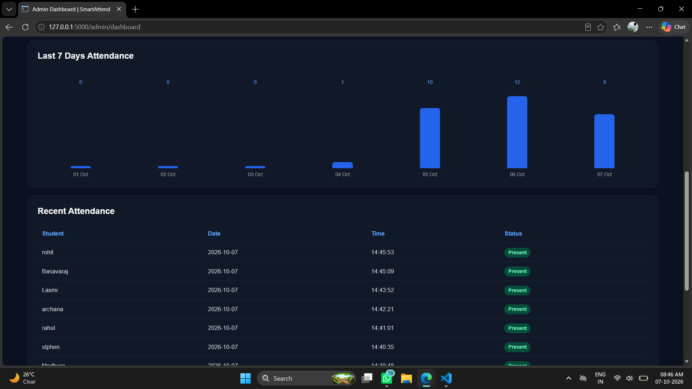
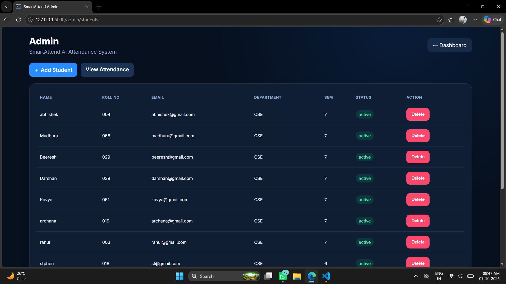
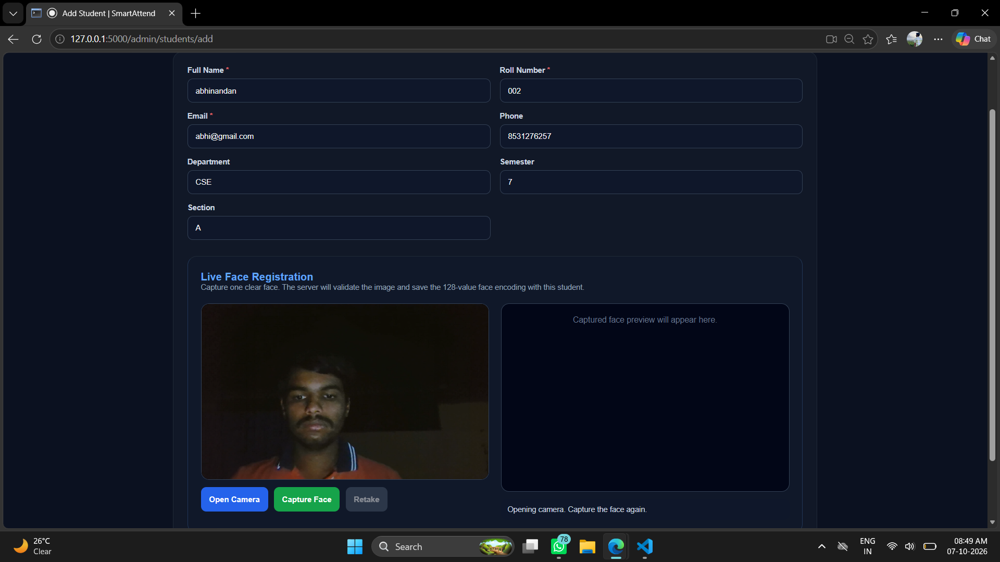
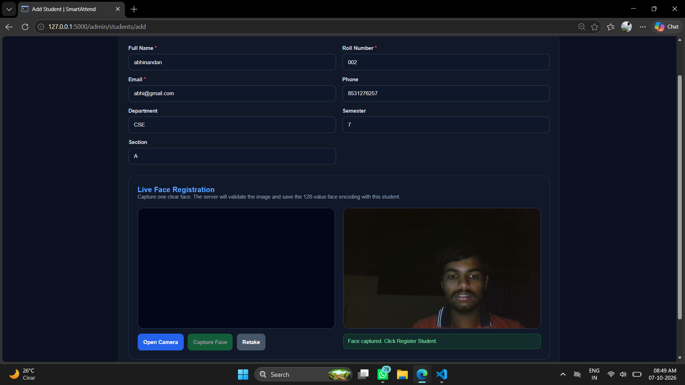
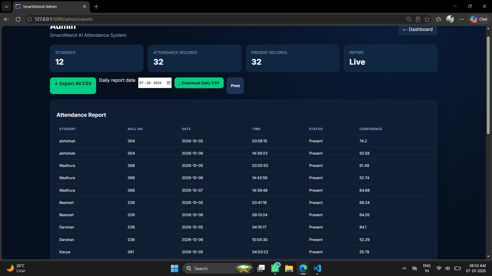

# 🤖 AI Attend — Smart AI Attendance System

> **AI-powered attendance management using Face Recognition, Flask, OpenCV, and Firebase.**

AI Attend is a modern attendance management platform designed to make student attendance **faster, smarter, more accurate, and easier to manage**.

The system combines **Artificial Intelligence + Face Recognition + Flask + Firebase Firestore** to provide a complete workflow — from student registration and face enrollment to real-time attendance recognition, dashboards, and reports.

---

## ✨ Why AI Attend?

Traditional attendance methods can be time-consuming, repetitive, and difficult to maintain.

**AI Attend transforms that workflow.**

- 👤 Register students with academic details
- 📸 Capture and store a student's face encoding
- 🧠 Recognize registered students using AI
- ✅ Automatically mark attendance after a valid face match
- 🔐 Protect access using Firebase Authentication
- ☁️ Store attendance records in Firebase Firestore
- 📊 Display attendance statistics and reports
- 📥 Export attendance information
- 🚫 Reject unknown or unregistered faces

---

## 🚀 Key Features

### 👤 Student Management
Manage students with their name, roll number, email, phone, department, semester, section, and face registration.

### 🧠 AI Face Recognition
The camera compares a live face with active registered student face encodings. Only a valid registered match can be accepted.

### 📸 Live Face Registration
The administrator captures one clear face through the webcam. The server validates the image and generates the face encoding.

### ⚡ Real-Time Attendance
**Face detected → Face matched → Student identified → Attendance recorded**

### 🔐 Secure Authentication
Firebase Authentication protects administrator and student access.

### ☁️ Firebase Firestore
Firestore stores student records, attendance records, admin information, users, and optional system logs.

### 📊 Admin Dashboard
View total students, present/absent counts, attendance rate, daily attendance, charts, and quick actions.

### 📈 Reports
Review attendance data, filter records, export CSV files, and print reports.

---

# 🛠️ Technology Stack

| Technology | Purpose |
|---|---|
| 🐍 Python | Core programming language |
| 🌐 Flask | Web application backend |
| 🧠 face_recognition | Face encoding and matching |
| 👁️ OpenCV | Camera and image processing |
| 🔥 Firebase Authentication | Secure login |
| ☁️ Firebase Firestore | Database |
| 🎨 HTML / CSS | User interface |
| ⚡ JavaScript | Client-side interaction |
| 📊 CSV | Attendance export |

---

# 🏗️ System Architecture

```text
                    ┌──────────────────────┐
                    │      AI ATTEND       │
                    │    Landing Page      │
                    └──────────┬───────────┘
                               │
                               ▼
                    ┌──────────────────────┐
                    │    Firebase Login    │
                    └──────────┬───────────┘
                               │
                               ▼
                    ┌──────────────────────┐
                    │   Admin Dashboard    │
                    └──────────┬───────────┘
                               │
              ┌────────────────┼────────────────┐
              ▼                ▼                ▼
       Manage Students    AI Attendance      Reports
              │                │                │
              ▼                ▼                ▼
       Register Student    Detect Face      View / Export
              │                │
              ▼                ▼
         Capture Face     Face Encoding
              │                │
              ▼                ▼
        Store Encoding    Face Comparison
                               │
                         ┌─────┴─────┐
                         ▼           ▼
                       MATCH      NO MATCH
                         │           │
                         ▼           ▼
                  Mark Attendance  Reject
                         │
                         ▼
                  Firebase Firestore
```

---

# 🔄 Complete Attendance Workflow

1. **Admin Login** — Sign in through Firebase Authentication.
2. **Add Student** — Enter student and academic details.
3. **Capture Face** — Use the webcam to capture one clear face.
4. **Generate Encoding** — Convert the face into a numerical encoding.
5. **Start AI Camera** — Open the live attendance camera.
6. **Detect Face** — Detect the face in the camera frame.
7. **Compare Face** — Compare it with registered student encodings.
8. **Verify Student** — Accept only a valid registered match.
9. **Mark Attendance** — Save the attendance record in Firestore.
10. **View Results** — Review the result through dashboard, attendance, and reports.

---

# 📸 Project Screenshots

> **Explore the complete AI Attend experience — from secure authentication and student enrollment to AI-powered recognition and attendance reporting.**

> **All screenshots use repository-relative paths, so they display directly on GitHub when the matching files are committed to the `ui_images/` folder.**

---

## 🏠 1. Smart Attendance Home

**Image path:**

```text
ui_images/1.home.png
```

**Screenshot:**



---

## 🔐 2. Secure Admin Login

**Image path:**

```text
ui_images/2.admin_login.png
```

**Screenshot:**



---

## 📊 3. Intelligent Admin Dashboard

**Image path:**

```text
ui_images/3.admin_dashboard_1.png
```

**Screenshot:**



---

## 📈 4. Attendance Analytics Dashboard

**Image path:**

```text
ui_images/4.admin_dashboard_2.png
```

**Screenshot:**



---

## 👨‍🎓 5. Student Management

**Image path:**

```text
ui_images/5.students.png
```

**Screenshot:**



---

## 📝 6. Student Registration

**Image path:**

```text
ui_images/6.add_student_1.png
```

**Screenshot:**



---

## 📷 7. AI Face Enrollment

**Image path:**

```text
ui_images/7.add_student_2.png
```

**Screenshot:**



---

## 📋 8. Attendance Records

**Image path:**

```text
ui_images/8.attendance.png
```

**Screenshot:**


---

## 📑 9. Attendance Reports

**Image path:**

```text
ui_images/9.report.png
```

**Screenshot:**



---

## 🤖 10. Live AI Face Recognition

**Image path:**

```text
ui_images/10.attendance_recognition.png
```

**Screenshot:**


---

# 🎯 Face Recognition Security

Attendance is not granted simply because a face is detected.

```text
Face Detected
     ↓
Registered Face?
     ↓
    YES
     ↓
Face Distance Within Threshold?
     ↓
    YES
     ↓
Student Identified
     ↓
Attendance Checked
     ↓
Attendance Marked
```

For an unknown face:

```text
Face Detected
     ↓
No Registered Match
     ↓
Unknown Face
     ↓
Attendance NOT Marked
```

---

# 📁 Main Project Structure

```text
ai-attendance-system/
│
├── app.py
├── config.py
├── requirements.txt
├── .env
├── README.md
│
├── ai/
│   └── face_service.py
│
├── firebase/
│   ├── firebase_config.py
│   └── serviceAccountKey.json
│
├── routes/
│   ├── auth_routes.py
│   ├── admin_routes.py
│   ├── student_routes.py
│   ├── attendance_routes.py
│   └── camera_routes.py
│
├── templates/
│   ├── base.html
│   ├── index.html
│   ├── login.html
│   ├── camera.html
│   ├── admin/
│   └── student/
│
├── static/
│   ├── css/
│   └── js/
│
└── ui_images/
    ├── 1.home.png
    ├── 2.admin_login.png
    ├── 3.admin_dashboard_1.png
    ├── 4.admin_dashboard_2.png
    ├── 5.students.png
    ├── 6.add_student_1.png
    ├── 7.add_student_2.png
    ├── 8.attendance.png
    ├── 9.report.png
    └── 10_attendance_recognition.png
```

---

# 🔥 Firebase Collections

```text
admins/
students/
attendance/
users/
system_logs/
```

### Students
Stores student information and registered face encoding.

### Attendance
Stores student, date, time, status, confidence, face distance, and camera information.

### Admins
Stores administrator authorization information.

---

# 🔐 Security

- Firebase Authentication handles credentials.
- Flask verifies authenticated users and roles server-side.
- State-changing requests use CSRF validation.
- Service-account credentials remain server-side.
- Face encodings should be treated as sensitive biometric information.
- Unknown faces are not automatically given attendance.

---

# ⚙️ Installation

### Windows

```bash
python -m venv venv
venv\Scripts\activate
pip install -r requirements.txt
```

### macOS / Linux

```bash
python -m venv venv
source venv/bin/activate
pip install -r requirements.txt
```

> If `face-recognition` or `dlib` installation fails on Windows, use a compatible Python 3.10/3.11 environment.

---

# 🔥 Firebase Setup

1. Create a Firebase project.
2. Enable Firestore Database.
3. Enable Authentication → Email/Password.
4. Create a Firebase Web App.
5. Add the Firebase web configuration to `.env`.
6. Create a Firebase Admin SDK service account.
7. Download the service-account JSON.
8. Save it as:

```text
firebase/serviceAccountKey.json
```

---

# ▶️ Run the Application

```bash
python app.py
```

Open:

```text
http://127.0.0.1:5000
```

---

# 📊 Project Flow at a Glance

```text
          AI ATTEND
              │
              ▼
        Secure Login
              │
              ▼
       Admin Dashboard
              │
       ┌──────┼───────┐
       ▼      ▼       ▼
   Students  Camera  Reports
       │      │
       ▼      ▼
   Register  Detect Face
   Student       │
       │         ▼
       ▼      Compare
  Capture Face   │
       │      ┌──┴──┐
       ▼      ▼     ▼
  Face Encoding YES   NO
              │      │
              ▼      ▼
         Attendance  Reject
              │
              ▼
          Firestore
```

---

# 🌟 Project Highlights

- 🤖 AI-powered face recognition
- 📸 Live webcam face registration
- ⚡ Real-time attendance
- 🔐 Firebase authentication
- ☁️ Firestore database
- 👨‍🎓 Student management
- 📊 Attendance analytics
- 📈 Reports and CSV export
- 🚫 Unknown-face rejection
- 🎨 Modern responsive interface
- 🔒 Server-side authorization
- 🧩 Modular Flask architecture

---

# 🏁 Conclusion

**AI Attend** brings Artificial Intelligence into everyday academic attendance management.

By combining **Face Recognition, Flask, OpenCV, Firebase Authentication, and Firestore**, the project provides a complete workflow for student registration, identity verification, automatic attendance marking, monitoring, and reporting.

The result is a **smarter, faster, secure, and more organized digital attendance experience** for educational institutions.

---

## ⚠️ Important Limitation

The camera workflow compares captured face images with registered face encodings. It is **not a dedicated liveness or anti-spoofing system**. Additional liveness detection would be required for stronger protection against presentation attacks such as photographs.

---

# 👨‍💻 AI Attend

**Smart AI Attendance System Using Face Recognition**

**Core Technologies:**  
Python • Flask • OpenCV • face_recognition • Firebase • Firestore • HTML • CSS • JavaScript

**Purpose:**  
> **Automated, intelligent, and secure student attendance management.**
